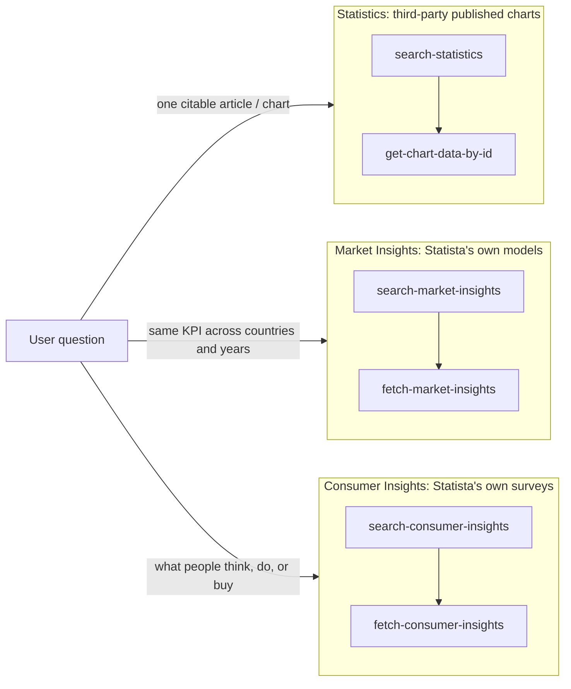

# Statista data catalogue (MCP)

Six tools, three search-then-fetch pairs. Every pair works the same way. A cheap `search-*` call returns candidate IDs plus metadata, then a `fetch-*`/`get-*` call returns the full numbers for one ID. Never skip the search step. Every ID, geo code, or question/answer ID you pass to a fetch call must come verbatim from a search result you already got back in this conversation. Guessed IDs return clean 404s, so there is no shortcut worth trying.

## What each pair wraps

The three pairs aren't different query shapes over one dataset. Each wraps a different Statista product with a different origin for the numbers, and that origin decides how you cite a figure and how much weight it can take.

- **Statistics** (`search-statistics` / `get-chart-data-by-id`) wraps Statista's core catalogue: over a million already-published charts from roughly 22,500 outside publishers, including market research firms, trade associations, scientific journals, and government agencies, across some 170 industries. Statista didn't produce these numbers, it curated and indexed someone else's. Every result carries a named external publisher, and that publisher is who you cite, not Statista.
- **Market Insights** (`search-market-insights` / `fetch-market-insights`) wraps Statista's own analyst-built market-sizing and forecasting models, the "Outlook" product line. The in-house KPI models cover 1,000+ market segments across 190+ countries, built with a hybrid top-down/bottom-up method and increasingly fed by Statista's own Consumer Insights survey data. These are Statista's numbers, which is why they come back as structured multi-year, cross-country time series rather than one citable chart. You can query a model at any country/year it covers. You can't do that with a single published statistic.
- **Consumer Insights** (`search-consumer-insights` / `fetch-consumer-insights`) wraps Statista's own survey panel: proprietary online surveys fielded in 50+ countries, up to 60,000 respondents per country, asking people directly about attitudes, purchases, media habits, and brand interactions. This is neither a third-party citation nor a model. Results are crosstabs of real respondent answers, and the citation is "Statista Consumer Insights" itself, never an external publisher.

## Which pair to use

| User is asking about... | Underlying data is... | Use |
|---|---|---|
| A specific published stat or chart ("how many EVs were sold worldwide in 2023") | A third-party figure Statista aggregated and indexed | `search-statistics` then `get-chart-data-by-id` |
| Market size, forecasts, or KPIs compared across countries and years | Statista's own in-house market model | `search-market-insights` then `fetch-market-insights` |
| What consumers think, do, buy, or how that varies by demographic or country | Statista's own primary survey results | `search-consumer-insights` then `fetch-consumer-insights` |

These overlap. "Coffee consumption in Brazil" returns real results in both `search-statistics` and `search-consumer-insights`, because an outside publisher and Statista's own survey program can research the same topic independently. When it's ambiguous, start with `search-statistics`, which casts the widest net. Switch to Market Insights if the user needs the same KPI across several countries or years, since one citation won't support that. Switch to Consumer Insights if the question is really about attitudes and behavior rather than market-level numbers, since only primary survey data answers "what do people think".

## Combining tools across pairs

Plenty of real requests are best answered by chaining two or three pairs rather than picking one. Watch for these patterns.

- **Market entry and opportunity sizing.** Market Insights gives the target market's size and forecast in the target country. Consumer Insights gives that country's attitude or intent toward the category. A market-size number alone says nothing about whether people would actually buy.
- **Competitive snapshot for a deck.** Use `search-statistics` for a named-competitor or ranking chart as the citable headline, then Market Insights for the category's multi-year trend to put that headline in context. Is the leader gaining share or losing it?
- **"What's driving this" narratives.** Take the aggregate number from Market Insights, then use Consumer Insights to explain the shift behind it. Market Insights shows revenue growth by country, Consumer Insights shows which demographic is driving adoption.
- **Cross-country strategy comparisons.** Fetch one KPI across several countries via Market Insights, then fetch those same countries' attitudes on a related question via Consumer Insights, using matching `country` values and a shared demographic column. Check whether the attitude gaps track the KPI gaps.
- **Sanity-checking a load-bearing number.** If a `search-statistics` hit gives a single-point figure a decision will hinge on, look for a comparable multi-year series in Market Insights. Two independently sourced Statista datasets agreeing, or not, tells you how much weight that number can take.

When you combine pairs, cite each tool's source separately instead of blending them. Statistics and Market Insights carry a named outside publisher or Statista's own model, Consumer Insights comes from Statista's surveys. If two pairs disagree, say so to the user rather than quietly picking one. Different methodology, a different survey wave, or a different geo grouping will all do that.

## Rules that apply to all six tools

- **Never invent an ID, geo code, or question/answer ID.** Use only values that literally appeared in a `search-*` result you already got back in this conversation. Plain-English guesses like "age" or "gender", and hand-crafted-looking IDs, 404. Confirmed on every tool, in every domain tested.
- **Don't re-issue an identical search query.** The connector returns identical results for an identical query within a conversation. Vary the wording, or reuse the results you have.
- **Don't re-fetch data you already have.** `get-chart-data-by-id(id)`, `fetch-market-insights(id, geo)`, and `fetch-consumer-insights(rows, columns, filters, country, year)` are deterministic per exact parameter tuple within a conversation. Refetching the same tuple burns a call for identical data.
- **Always cite sources, not internal IDs.** For statistics and market insights, name the publisher in the result, e.g. "EV-Volumes.com via Statista", rather than "Statista" alone. For consumer insights, cite "Statista Consumer Insights" and never the `survey_id` field.
- **A well-formed result is not proof of relevance.** All three search tools can return real, on-corpus data that doesn't answer the question. A narrow or local topic tends to surface plausible adjacent stats instead of a clean miss, and a one-word query returns scattered hits or nothing. Read the title, description, and `ranking_score` before you fetch a hit and cite it. Don't grab the top result just because the call succeeded.
- Keep search queries to 2-4 words naming the actual topic, rather than one generic word or a full sentence. Specificity drives relevance here, not length.
- Error text differs by cause within a single tool. "id not found" is not "no data for that combination" is not a parameter-validation failure. Read the message instead of assuming every failure means you need a different query. Each pair's reference file lists the exact error shapes observed.

## Pair 1: search-statistics + get-chart-data-by-id

`search-statistics(query)` searches Statista's general catalogue of published charts, and it's the broadest and most topic-agnostic of the three search tools. Each item returns a numeric `identifier`, title, description, `geolocations`, `industries`, `sources`, an `is_premium` flag, and a `ranking_score`. Results arrive pre-sorted by relevance, so the first hit is the best match on offer. `get-chart-data-by-id(id)` takes that `identifier` and returns the full numeric series plus methodology and source detail. `is_premium: true` doesn't block access, the detailed fetch still returns full data.

An ID that didn't come from a search returns a 404 like `Could not find statistic #<id>`. Result quality tracks query specificity, not the industry. Vague single-word queries underperform on every topic, and even a nonempty response can be off-target for a very niche ask. See the reference file.

See `references/statistics.md` for use cases, data-structure and interpretation guidance, and a few illustrative examples. It isn't a topic list.

## Pair 2: search-market-insights + fetch-market-insights

`search-market-insights(query)` searches cross-country market and KPI datasets. **Don't put a country or region name in the query itself.** Geography comes entirely from the `covered_geos` field each result returns, a map of geo code to English name, e.g. `{"DEU": "Germany", "EUR": "Europe", "WLD": "Worldwide"}`. `fetch-market-insights(id, geo)` then pulls that dataset's time series, restricted to a comma-separated list of geo codes.

Key constraints:
- `geo` codes must be copied from that specific dataset's own `covered_geos`. Codes aren't universal across datasets, and region or bloc codes like `EUR`, `G7`, `BRICS`, `MENA`, plus country groupings like `CHK`, sit alongside plain ISO-style country codes. Even a code listed in `covered_geos` isn't always accepted by the fetch call, and broad bloc codes get rejected more often than plain country codes. The reference file has the exact error.
- Max 5 geo codes per call, enforced as a parameter-validation error before any network round-trip. If the user needs more than 5, say a global country-by-country breakdown, issue multiple `fetch-market-insights` calls with disjoint geo sets so every geo is covered exactly once.
- `geo` defaults to `WLD` when omitted, but datasets with narrow geo coverage, a handful of countries or blocs rather than dozens, often don't list `WLD` at all. Always check `covered_geos` before relying on the default. Omitting geo on a WLD-less dataset produces a confusing 404 instead of telling you which geos are valid.
- An invalid geo code returns a 400, `Invalid 'geo' value...`. An invalid or garbage id returns a 404, `Dataset not found`. These are genuinely different causes, so check which one you got before retrying.
- Treat `market_type` and `market_type_description` as a rough grouping hint, not a precise category filter. They've been seen slightly mismatched to a dataset's actual subject.

See `references/market-insights.md` for use cases, data-structure and interpretation guidance, exact error text for the boundary cases, and a few illustrative examples. It isn't a market list.

## Pair 3: search-consumer-insights + fetch-consumer-insights

`search-consumer-insights(query)` searches survey questions and answers on consumer attitudes and behavior worldwide, returning question IDs like `v0013g_demo_generation` and answer IDs like `v0013g_demo_generation#4`. `fetch-consumer-insights(rows, columns, filters, country, year)` returns a crosstab. `rows` is required and takes exactly one question or answer ID, never comma-separated. `columns` optionally takes one more ID, usually a demographic answer ID, to produce a breakdown. `filters` takes a list of answer IDs that narrow the respondent base without adding a breakdown column.

Key constraints:
- As a rule of thumb, pair one topic question with a demographic column or filter rather than combining two topic questions. This is a soft limit, not always an enforced one. Two topic questions together can return a real crosstab, or can silently degrade into a "Fusion Data Notice", which means statistical-twin imputation rather than a measured joint response. Check the result's title and description for that notice before treating a two-topic crosstab as directly measured. A *third* non-demographic split, two topics plus a topic-based filter, does reliably hard-error.
- Searching a demographic concept with different wording, "age groups" versus "generation demographic", can return different subsets of valid answer IDs for the same question. This holds for age, income, education, and gender alike. Income and education in particular often have entirely different IDs, bands, and labels per country, so don't assume an ID or its answer options transfers between markets.
- Omitting `country` returns an array of crosstabs auto-picked across a small default set of countries, not broad global coverage. Pass an explicit 3-letter ISO alpha-3 `country`, e.g. `USA`, `DEU`, `BRA`, whenever the user cares about a specific market or wants one clean answer.
- Answer IDs get retired or replaced between survey waves. Requesting a `year` the question wasn't fielded in doesn't error either, it silently substitutes the earliest available wave without flagging the swap. If the exact year matters, read the wave date in the response instead of trusting that your requested `year` was honored.
- An invented ID, a plain word like `"age"` or a guessed sequential-looking `v9990_demo_age`, returns a 404: `Question or answer not found: <id>`. That's distinct from a real question/answer combination in a country where the question simply wasn't fielded, which returns `No crosstab solution found...`. A smaller country isn't inherently unsupported, it depends on whether that specific question ran there.

See `references/consumer-insights.md` for use cases, data-structure and interpretation guidance, and a few illustrative examples. It isn't a topic or country list.
